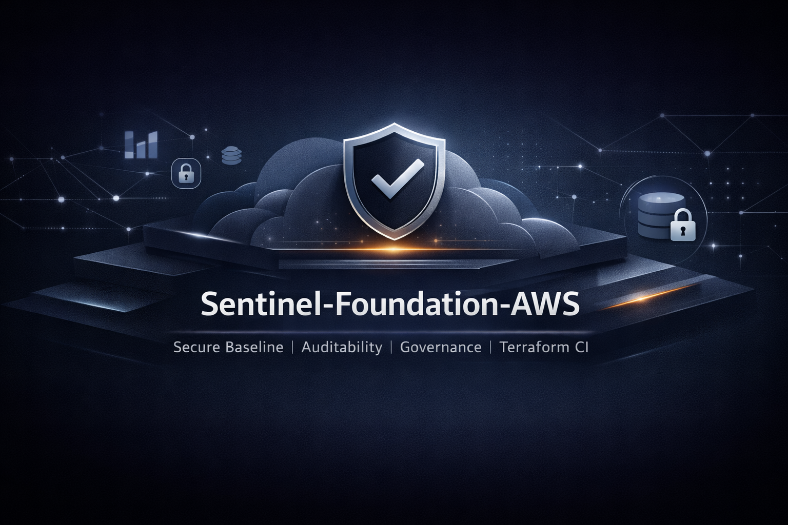
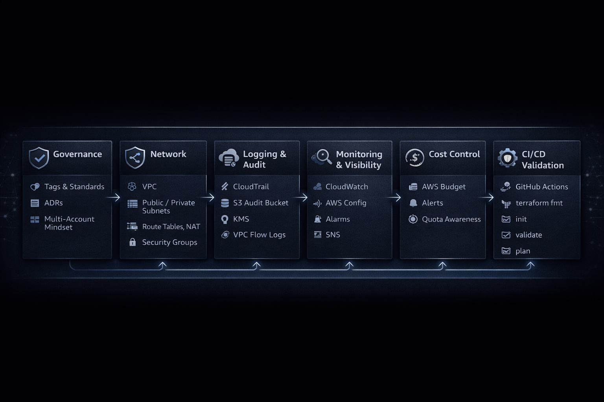
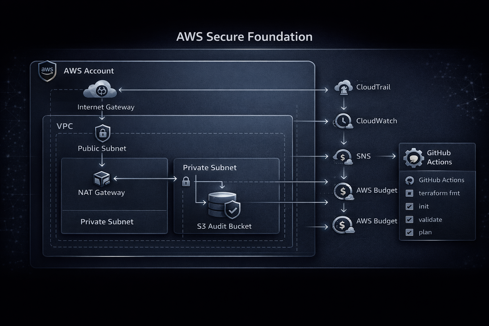
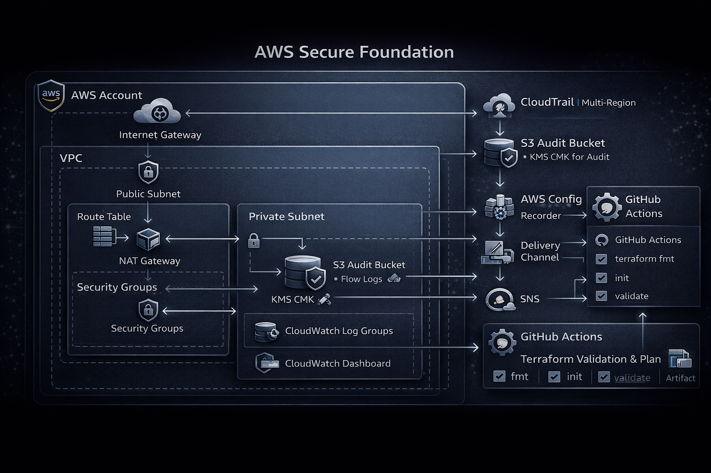
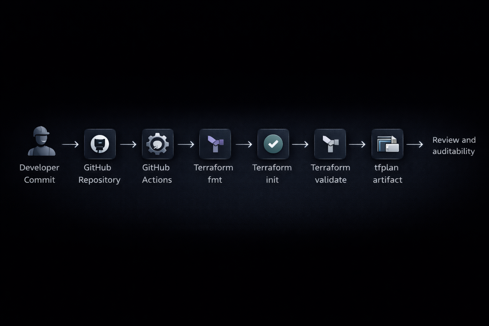
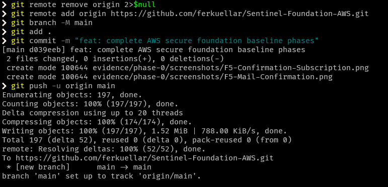
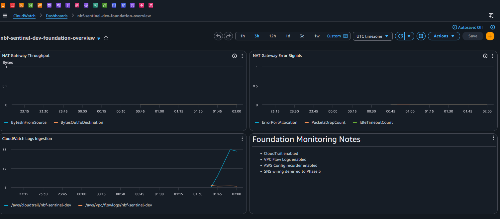
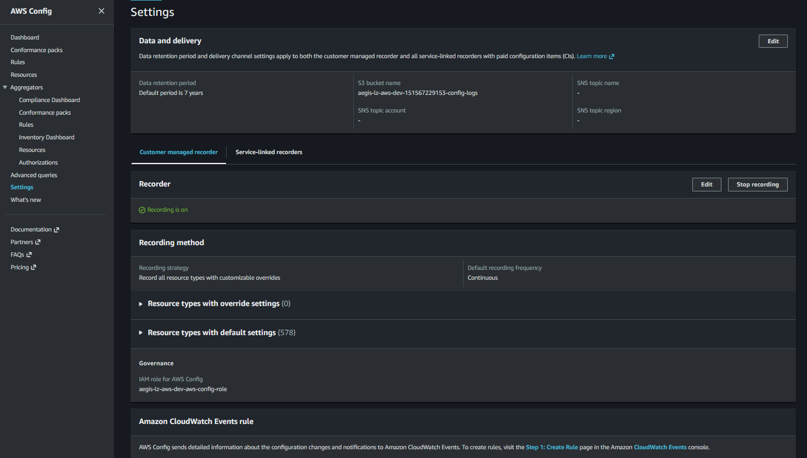
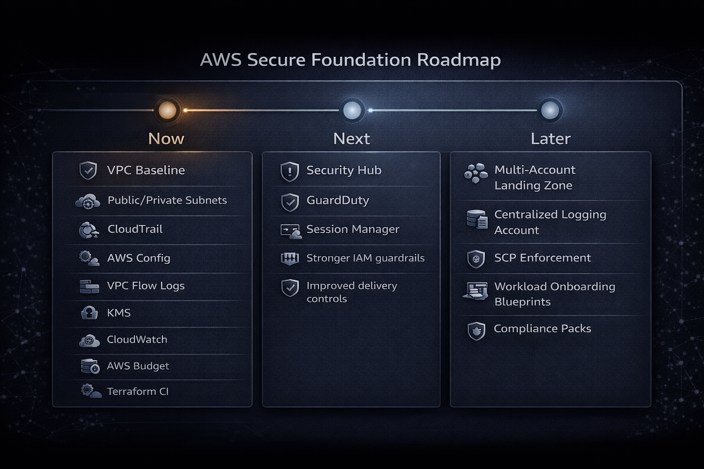

# Sentinel-Foundation-AWS

> Enterprise-ready AWS secure foundation baseline built with Terraform, governance controls, auditability, cost awareness, and CI/CD validation.

<p align="center">
  
</p>

---

## Executive Summary

**Sentinel-Foundation-AWS** is a production-minded AWS secure foundation project designed to demonstrate how to build a reusable, enterprise-style baseline beyond a simple networking lab. It combines **network segmentation, governance controls, logging, encryption, monitoring, budget awareness, and CI/CD validation** into a foundation that reflects how cloud platforms are evaluated in real architecture environments.

This repository is intentionally positioned as a **secure baseline for future workload onboarding**, not as a one-off infrastructure exercise. It shows architectural judgment, implementation discipline, and the ability to connect infrastructure decisions with **security, operations, cost, and scalability outcomes**.

---

## Why This Project Matters

Most cloud repositories stop at “VPC + subnets + security groups.” That is not enough.

This project is built to show how a cloud architect should think at a higher level:

- how to establish a **secure-by-default baseline**
- how to introduce **governance and auditability** early
- how to design a reusable network foundation for future workloads
- how to make cost and operational visibility part of the platform from day one
- how to validate infrastructure changes through **Terraform CI/CD**
- how to document trade-offs through **Architecture Decision Records (ADRs)**
- how to capture implementation evidence in a way that supports technical review

In other words, this repo is meant to answer a real hiring-manager question:

**Can this person build not just infrastructure, but a foundation that an enterprise team could evolve?**

---

## Architecture at a Glance

<p align="center">
  
</p>

### Core Layers

#### Governance Layer
- multi-account mindset
- naming and tagging standards
- reusable Terraform structure
- ADR-driven decisions

#### Network Layer
- VPC
- public and private subnets
- Internet Gateway
- NAT Gateway
- route tables
- Security Groups
- bastion access pattern

#### Logging and Audit Layer
- KMS CMK
- CloudTrail multi-region
- S3 audit bucket
- CloudWatch log groups
- VPC Flow Logs

#### Monitoring and Visibility Layer
- AWS Config baseline
- CloudWatch dashboard
- alarms
- SNS alerting

#### Cost Control Layer
- AWS Budget
- budget threshold alerts
- quota and cost-awareness strategy

#### Delivery Layer
- Terraform validation
- Terraform plan artifact generation
- GitHub Actions pipeline

---

## Architecture Goals

The project was designed with the following goals:

- establish a reusable **AWS secure foundation**
- separate public and private network boundaries
- provide a baseline for **logging, audit, and configuration visibility**
- enforce **encryption for audit-related resources**
- create operational hooks for **monitoring and alerting**
- introduce **budget awareness** as part of the foundation layer
- validate Terraform changes through **GitHub Actions**
- document decisions, risks, trade-offs, and next-stage evolution

---

## Scope

### Implemented

- VPC with public and private subnets
- Internet Gateway and NAT Gateway
- route tables and subnet associations
- Security Groups and bastion access pattern
- KMS CMK for logging-related encryption
- Multi-Region CloudTrail
- S3 audit bucket
- CloudWatch log groups
- VPC Flow Logs
- AWS Config baseline
- CloudWatch dashboard and alarms
- SNS alerting
- AWS Budget alerts
- GitHub Actions pipeline for Terraform validation and plan
- ADR documentation pack
- risk and trade-off documentation
- enterprise roadmap
- evidence captured by implementation phase

### Intentionally Left for Future Evolution

- Security Hub
- GuardDuty
- centralized logging account
- Control Tower or Landing Zone Accelerator alignment
- Session Manager-based administration pattern
- multi-account deployment orchestration
- SCP-backed guardrail expansion
- conformance packs and compliance mapping

That separation is deliberate. Good architecture is not about pretending everything is finished; it is about showing what is implemented, what is deferred, and why.

---

## Visual Architecture

### Executive Architecture View

<p align="center">
  
</p>

### Technical Architecture View

<p align="center">
  
</p>

### CI/CD Validation Flow

<p align="center">
  
</p>

---

## Design Principles

### Secure by Default
Security controls are introduced as part of the baseline, not bolted on later.

### Observable by Design
Logging, monitoring, and configuration visibility are treated as first-class requirements.

### Reusable, Not Disposable
The project is written as a foundation that could evolve into a broader landing-zone style implementation.

### Cost-Aware, Not Cost-Blind
Budgeting and alerting are included because cloud architecture without cost controls is amateur hour.

### Documented Trade-offs
Decisions are explicitly documented through ADRs and supporting notes rather than hidden in Terraform code.

---

## Repository Structure

```text
Sentinel-Foundation-AWS/
├── .github/                # GitHub Actions workflows
├── diagrams/               # Executive and technical architecture diagrams
├── docs/                   # Architecture docs, ADRs, risks, trade-offs, roadmap
├── evidence/               # CLI outputs, screenshots, phase-based validation
├── infra/                  # Terraform code
└── README.md
```

### Repository Components

#### `infra/`
Contains the Terraform implementation for the AWS secure foundation baseline.

#### `docs/`
Contains architecture documentation including:
- architecture overview
- ADRs
- risks and trade-offs
- security model notes
- roadmap and future-state evolution

#### `evidence/`
Contains implementation proof by phase, including:
- commands executed
- CLI output
- screenshots
- issues encountered
- fixes applied
- validation checkpoints

#### `diagrams/`
Contains visual assets for both executive and technical audiences.
- executive architecture view
- technical architecture view
- roadmap or evolution view

---

## Key Architectural Decisions

This project documents major decisions explicitly through ADRs, including:

- custom secure foundation vs. Control Tower-first approach
- single NAT Gateway vs. NAT per Availability Zone
- customer-managed KMS key vs. AWS-managed encryption
- CloudTrail + VPC Flow Logs as mandatory telemetry
- budget alerts in the baseline layer
- bastion pattern vs. Session Manager pattern

These ADRs matter because senior architecture is not just resource creation. It is decision quality under constraints.

---

## Security Model

The security posture of the project is based on layered baseline controls:

- network segmentation with public/private subnet separation
- tightly scoped security boundaries through Security Groups
- centralized logging and audit trail collection
- encryption for logging-related services using KMS
- AWS Config for baseline configuration visibility
- CloudTrail for API activity tracking
- VPC Flow Logs for network observability
- bastion-based administrative access pattern

This is not a full landing zone or zero-trust implementation, and it does not pretend to be. It is a **credible baseline** designed to be extended.

---

## Operational Model

The repository assumes an engineering workflow where infrastructure changes are:

1. updated in Terraform
2. validated locally
3. pushed through GitHub Actions
4. reviewed via plan output
5. supported with evidence and documentation

This reflects an operational mindset where infrastructure is treated as a governed delivery artifact rather than a one-off console exercise.

---

## Evidence Model

Each implementation phase captures a consistent evidence set:

- objective
- files modified
- commands executed
- expected result
- actual result
- CLI evidence
- console screenshots
- issue found
- fix applied
- next phase gate

This makes the repo stronger during reviews because it shows not only what was built, but how it was validated.

## Evidence Highlights

<p align="center">
  
</p>

<p align="center">
  
</p>

<p align="center">
  
</p>

<p align="center">
  
</p>

---

## Risks and Trade-offs

### Single NAT Gateway
Using a single NAT Gateway reduces cost and keeps the baseline simple, but it introduces a higher-availability trade-off compared to a per-AZ design.

### Bastion Access Pattern
A bastion is familiar and easy to explain, but AWS Systems Manager Session Manager is generally the better long-term pattern for reducing inbound administrative exposure.

### Single-Account Baseline
This repo uses multi-account thinking, but not full multi-account deployment. That keeps implementation practical while still aligning with enterprise expansion paths.

### Baseline vs. Full Landing Zone
This project is intentionally a secure foundation, not a fully opinionated landing zone. That boundary keeps the repo focused and makes the design intent clear.

---

## CI/CD Validation

Terraform validation is integrated through GitHub Actions to support repeatable delivery.

### Pipeline Intent

- validate Terraform formatting
- validate Terraform configuration
- generate Terraform plan
- preserve outputs for technical review

This improves quality, reduces drift risk, and aligns the project with real delivery practices.

---

## How to Use

### Prerequisites

- AWS account
- Terraform installed
- AWS CLI configured
- appropriate IAM permissions
- GitHub repository with Actions enabled

### Typical Workflow

```bash
terraform init
terraform fmt -check
terraform validate
terraform plan
terraform apply
```

You should also capture supporting evidence for each major phase if you want the repo to tell the full story.

---

## What This Repository Demonstrates

This project is intended to demonstrate capability in:

- AWS secure foundation design
- Terraform-based infrastructure delivery
- governance-first cloud thinking
- auditability and observability design
- cost-aware architecture
- CI/CD for infrastructure validation
- architecture documentation and decision tracking
- enterprise-style project communication

That combination is the real point of the repo.

---

## Roadmap

<p align="center">
  
</p>

### Near-Term Enhancements
- adopt OIDC-based GitHub authentication
- replace bastion pattern with Session Manager
- add Security Hub and GuardDuty
- introduce centralized logging patterns

### Mid-Term Evolution
- align with Control Tower or Landing Zone Accelerator
- implement stronger guardrails with SCPs
- add compliance mappings and conformance packs

### Long-Term Direction
- multi-account secure platform baseline
- workload onboarding blueprints
- security service centralization
- operational maturity expansion

---

## Final Positioning

**Sentinel-Foundation-AWS** should be discussed as an **enterprise-ready AWS secure foundation baseline** that demonstrates more than infrastructure provisioning.

It shows:

- implementation depth
- architecture judgment
- operational discipline
- governance awareness
- documentation maturity
- evidence-driven validation

---

## Author

**Fernando Kuellar**  
Cloud Architect | Data Engineer | Secure Cloud Foundations | FinOps-Aware Architecture
